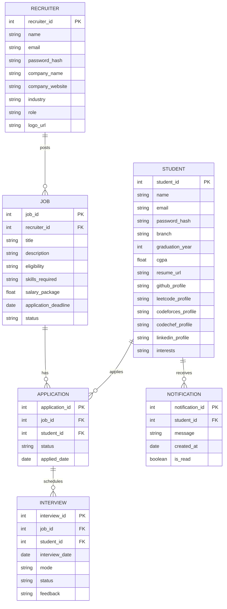

# HireHUB

### The Smart Placement Portal for Students, Recruiters & Colleges

---

## Overview

**HireHUB** is an intelligent placement management system that bridges the gap between **students**, **recruiters**, and **college administrators**.
It simplifies the end-to-end placement process — from **resume parsing** and **job applications** to **interview scheduling** and **analytics** — all in one powerful platform.

### Core Idea

* **Students** can auto-generate profiles from resumes, apply to jobs, and track every step of their placement journey.
* **Recruiters** can post jobs, shortlist candidates, schedule interviews, and analyze hiring data effortlessly.
* **Admins** can oversee placement drives, verify companies, and ensure smooth collaboration between all stakeholders.

---

## Features

### Student Features

* **Registration & Profile Setup**

  * Email or SSO login (Google, GitHub, etc.)
  * Upload resume → Auto extract academic details, skills, and achievements
  * Integrations with:

    * GitHub (repositories, stars, contributions)
    * LeetCode, Codeforces, CodeChef (ratings, problems solved)
    * LinkedIn profile linking
* **Dashboard**

  * Personalized job recommendations
  * Track applied jobs, deadlines, and notifications
  * Real-time updates for shortlists, interviews, and results
* **Applications**

  * Apply directly from the portal
  * Track application status (Applied → Shortlisted → Interview → Result)
  * Download interview schedules
* **Resources**

  * Access curated prep materials, mock questions, and interview guides
  * Sync interview dates with Google Calendar
  * Email and in-app notifications for reminders and updates

---

### Recruiter Features

* **Profile & Verification**

  * Company registration with admin verification
  * Add company logo, description, website, and offered roles
* **Job Management**

  * Post jobs with eligibility, skillsets, salary, and deadlines
  * Edit or archive previous postings
* **Candidate Search**

  * Filter by branch, CGPA, skills, and coding handles
  * Bulk shortlist or download resumes
  * AI-powered candidate recommendations
* **Application Tracking**

  * Monitor applications by job
  * Update candidate statuses (Shortlisted, Rejected, Selected)
  * Export reports for analysis
* **Interview Management**

  * Schedule interviews via Google Meet or Zoom
  * Send automatic notifications to candidates
  * Upload test links or assignments
* **Reports & Analytics**

  * View dashboards for applications and selections
  * Visualize skill distributions and hiring ratios
  * Export analytics reports for HR teams

---

## Example Workflows

### Student Flow

1. Register or login to the portal
2. Upload resume → Profile auto-generated
3. Dashboard shows personalized job matches
4. Apply to jobs and track status in real-time
5. Get shortlisted → Attend interviews → View results
6. Use resources for preparation and skill improvement

### Recruiter Flow

1. Register company account → Await admin verification
2. Post job openings with details and eligibility
3. Review student applications and filter by criteria
4. Shortlist and schedule interviews seamlessly
5. Update results → Students notified automatically
6. Export analytics for performance tracking

---

## Tech Stack

| Layer                       | Technologies                           |
| --------------------------- | -------------------------------------- |
| **Frontend**                | Next.js, React, Tailwind CSS           |
| **Backend**                 | Node.js, Express.js                    |
| **Database**                | MongoDB or PostgreSQL                  |
| **Authentication**          | NextAuth, JWT, OAuth (Google, GitHub)  |
| **Resume Parsing (Future)** | Pyresparser, OpenAI API                |
| **APIs**                    | GitHub, LeetCode, Codeforces, CodeChef |
| **Notifications**           | SMTP (Email) + In-app                  |
| **Deployment**              | Render, Vercel, Docker                 |

---

## Future Scope

* **AI Resume Parsing:** Extract key details using NLP.
* **Smart Job Matching:** Rank students by skill-job fit using AI.
* **Blockchain Verification:** Issue verified digital offer letters and certificates.
* **Advanced Notification System:** Real-time in-app and email alerts.
* **Placement Analytics Dashboard:** Deep insights for colleges and companies.

---

## Database Schema

---

## Contributing

We welcome contributions from developers and designers.
To contribute:

1. Fork the repository
2. Create a new branch (`feature/new-feature`)
3. Commit your changes
4. Push the branch
5. Open a pull request

---
# Work Planned 

- Database : Suraj Kulkarni
- Backend Student Routes : Ansh Sharma 
- Backend Company Routes : Sunny Singh
- User Auth : Arpit Sarang

---

## License

This project is licensed under the **MIT License** — you can freely use, modify, and distribute it.

---

## Credits

