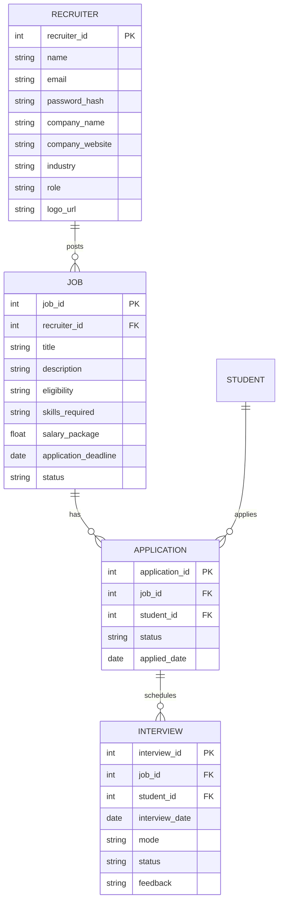

# Recruiter Portal – Documentation

## Overview

The recruiter portal is designed to provide companies and recruiters with an easy-to-use platform for managing placement drives, posting jobs, shortlisting candidates, and tracking hiring progress within the college ecosystem.

---

## Features for Recruiters

### 1. Registration & Profile Setup

* Recruiter/HR signs up with official email and company details.
* Admin approval system for verification.
* Company profile setup includes:

  * Company logo, description, website.
  * Industry type and offered roles.
  * Salary package, benefits, and policies.

### 2. Job Posting & Management

* Post job listings with details:

  * Role & job description.
  * Eligibility criteria (CGPA, branch, graduation year).
  * Skills required.
  * Application deadline.
* Ability to **edit, archive, or delete job postings**.

### 3. Candidate Search & Filtering

* Search for students using filters:

  * Branch, graduation year, CGPA.
  * Skills and interest areas.
  * Competitive programming profiles (LeetCode, GitHub, Codeforces).
* Resume viewing & downloading.
* AI-based **candidate recommendations** for each role.

### 4. Application Tracking

* View list of students who applied.
* Track **application status**:

  * Applied → Shortlisted → Interview → Selected/Rejected.
* Bulk shortlist/download resumes.
* Export candidate data in CSV/Excel format.

### 5. Interview & Process Management

* Schedule interviews directly through portal.
* Integration with Google Meet / Zoom.
* Automated email & in-app notifications to candidates.
* Upload test/assignment links for pre-screening.

### 6. Reports & Insights

* Analytics dashboard for recruiters:

  * Number of applicants per job.
  * Shortlist ratio and selection ratio.
  * Skills heatmap of applicants.
* Exportable reports for HR teams.

---

## Example Recruiter Flow

1. Recruiter visits portal → Registers/Login
2. Company profile verified by admin.
3. Recruiter posts a job with eligibility details.
4. Students apply → Recruiter views candidate list.
5. Recruiter shortlists candidates → Schedules interviews.
6. Interview results updated → Students notified.
7. Recruiter downloads analytics/reports for hiring process.

---

## Tech Notes (Future Scope for Recruiters)

* AI-powered **resume ranking system** to sort applicants by best match.
* One-click **bulk interview scheduling**.
* API integration with ATS (Applicant Tracking Systems).
* Candidate comparison feature (side-by-side view).
* Chat system for direct recruiter-student interaction.
* Blockchain-based **offer letter verification**.

---

# DATABASE SCHEMA (Recruiter-Centric)

